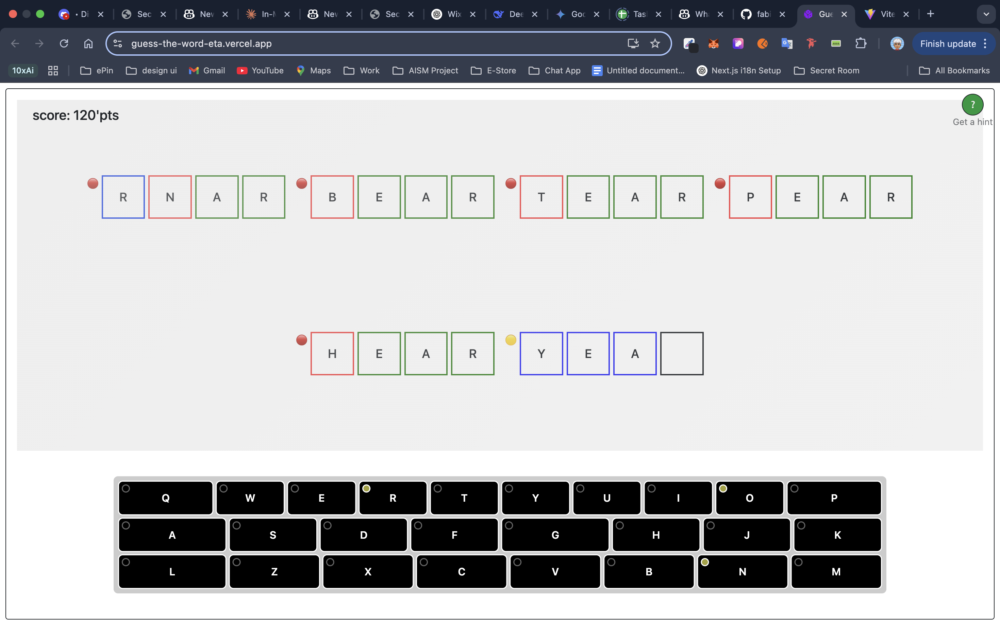

# Guess The Word 🧠🔤

A fun and interactive word-guessing game inspired by Wordle. Challenge yourself to guess an 8-letter secret word using color-coded feedback after each attempt. Perfect for sharpening your vocabulary and deduction skills.



---

## 🚀 Features

- 🎯 (5 to 8)-letter word challenge
- 🟩 Green = correct letter, correct position  
- 🟦 Blue = correct letter, wrong position  
- 🟥 Red = letter not in the word  
- ✅ Clean UI with immediate visual feedback
- 🔁 6 attempts Max

---

## 🛠 Tech Stack

- **Frontend**: React, CSS

---

## 📦 Setup Instructions

1. **Clone the repository**
   ```bash
   git clone https://github.com/fabiconcept/guess_the_word.git
   cd guess_the_word
````

2. **Start Local Server**

   * Run ```npm run start```

3. **Play!**

   * Type your guess
   * Use the color hints to find the correct word

---

## 📷 Screenshot

> *(Include a screenshot of gameplay here)*

---

## ✍️ Customization

* To change the target word, edit the `TARGET_WORD` variable in the JavaScript file (likely `script.js` or similar).
* You can expand the word list, add difficulty levels, or implement a timer for an advanced challenge.

---

## 🧠 Inspiration

Built for fun and practice, this project is a twist on the popular [Wordle](https://www.nytimes.com/games/wordle/index.html) game, pushing it further with 8-letter words and sharper logic.

---

## 💡 Ideas for Future Improvements

* ✅ Add mobile responsiveness
* ✅ Track time and number of attempts
* ✅ Save scores using localStorage
* ⌛📱 Add PWA support for offline play

---

## 📬 Contact

Built with ❤️ by [@fabiconcept](https://github.com/fabiconcept)